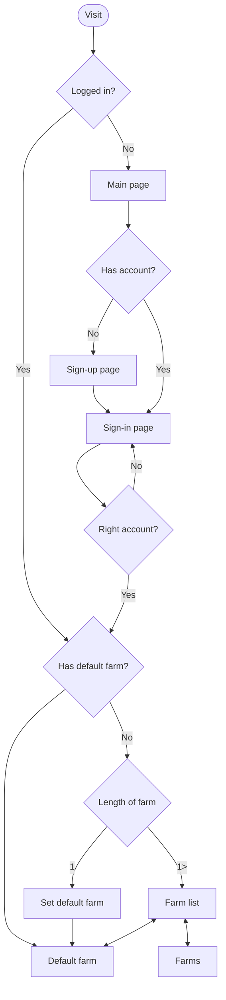

# Producer's Web

```mermaid
flowchart TD
    a([Visit]) --> b{Logged in?}
    b --> |No| c[Main page]
    d{Has default farm?}
    l[Default farm]
    e{Has account?}
    f[Sign-up page]
    g[Sign-in page]
    j[Set default farm]
     k[Farm list]
    b --> |Yes| d -->l
    c --> e
    e -->|No| f --> g
    i -->|1| j[Set default farm]  
    i -->|1>| k[Farm list]
    j -->l
    k <--> l
    k <--> Farms
    g --> h{Right account?}
    h -->|No|g
    h -->|Yes|d
    e -->|Yes| g
    d -->|No| i{Length of farm}
```