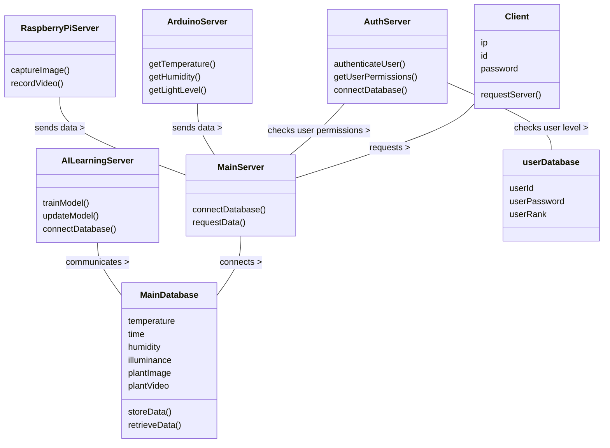

# Class Diagram

```mermaid
classDiagram


    class Client {
	    ip
        id
        password
        requestServer()
    }


    class MainServer {
        
        connectDatabase()
        requestData()
    }
    class AuthServer {

        authenticateUser()
        getUserPermissions()
        connectDatabase()
    }
    class AILearningServer {
        trainModel() 
        updateModel()
        connectDatabase()
    }


    class MainDatabase {
        temperature
        time
        humidity
        illuminance
        plantImage
        plantVideo
        storeData()
        retrieveData()
    }
    class userDatabase{
        userId
        userPassword
        userRank
    }


    class ArduinoServer {
        getTemperature()
        getHumidity()
        getLightLevel()
    }
    class RaspberryPiServer {
        captureImage()
        recordVideo()
    }

    Client -- MainServer : requests >

    MainServer -- MainDatabase : connects >


    AuthServer -- userDatabase : checks user level >
    AuthServer -- MainServer : checks user permissions >


    AILearningServer -- MainDatabase : communicates >

    ArduinoServer -- MainServer : sends data >
    RaspberryPiServer -- MainServer : sends data > 
```
