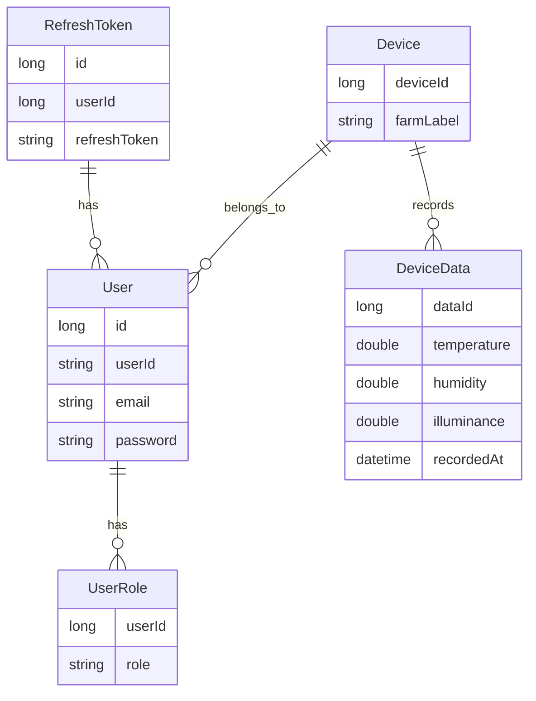

```mermaid
erDiagram
    RefreshToken {
        long id
        long userId
        string refreshToken
    }
    
    User {
        long id
        string userId
        string email
        string password
    }
    
    Device {
        long deviceId
        string farmLabel
    }

    DeviceData {
        long dataId
        double temperature
        double humidity
        double illuminance
        datetime recordedAt
    }

    UserRole {
        long userId
        string role
    }
    
    RefreshToken ||--o{ User : has
    Device ||--o{ User : belongs_to
    Device ||--o{ DeviceData : records
    User ||--o{ UserRole : has
```
